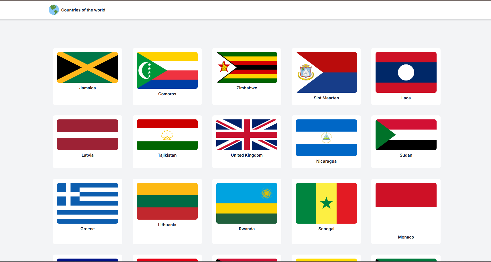
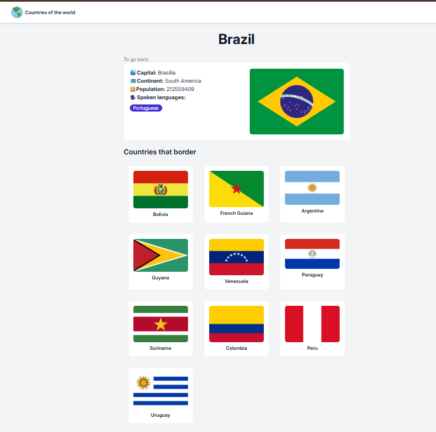

<h1 align="center">

    Countries App
</h1>


<div align="center">
    
    
   

</div>


## 📝 About
A **Countries Application** that displays information about countries using data from the *REST Countries API*. 

It features a list of countries and when selected, it will present details of the country such as population, capital, language and more informations.

## 🚀 Features
- **[React](https://react.dev/learn)**: A JavaScript library for building user interfaces.
- **[React Router](https://reactrouter.com/)**: For handling routing within the application.
- **[Vite](https://vite.dev/guide/)**: A fast build tool and development server.
- **[Tailwind CSS](https://tailwindcss.com/)**: A utility-first CSS framework for styling.
- **[REST Countries API](https://restcountries.com/)**: To fetch country data.
- **[Responsive Design](https://developer.mozilla.org/en-US/docs/Learn_web_development/Core/CSS_layout/Responsive_Design)**: Ensures the application looks good on all devices.


## ⏱️ Getting Started

### Installation

```bash
# clone the repository
$ git clone https://github.com/polyanetuag/countries-list.git

# enter the project
$ cd countries-list

# install dependencies
$ npm install or yarn

# start the development server
$ npm run dev or yarn dev

```


---

Development with ❤️ by Polyane Tuag 
